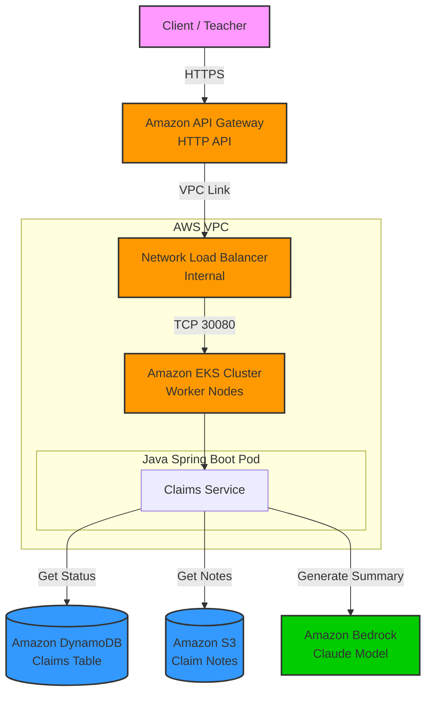

# Nexus Claims GenAI - Solution Architecture

## 1. Executive Summary

**The Challenge:** Insurance claim processing is traditionally manual, time-consuming, and prone to delays. Adjusters spend hours reading through unstructured notes to understand the history of a claim.

**The Solution:** The **Nexus Claims GenAI API** serves as a modern, scalable backend that automates the retrieval of claim status and leverages Generative AI (Amazon Bedrock) to instantly summarize complex claim history. This accelerates decision-making and improves customer satisfaction.

## 2. Solution Architecture

The following diagram illustrates the high-level architecture of the solution deployed on AWS.

## 3. Technology Choices & Rationale

### Compute: Amazon EKS (Elastic Kubernetes Service)
*   **Why:** Industry-standard container orchestration.
*   **Benefits:** provides high availability, scalability, and seamless migration paths for existing containerized applications. It allows the Claims Service to scale independently based on load.

### AI/ML: Amazon Bedrock
*   **Why:** Fully managed service for Generative AI.
*   **Benefits:** Zero infrastructure to manage. We access high-performance foundation models (Anthropic Claude) via a simple API call, reducing operational overhead and cost compared to self-hosting models.

### Database: Amazon DynamoDB
*   **Why:** Serverless NoSQL database.
*   **Benefits:** Single-digit millisecond latency for claim status lookups. It scales automatically to handle millions of requests without maintenance windows.

### Storage: Amazon S3
*   **Why:** Object storage for unstructured data.
*   **Benefits:** Highly durable and cost-effective storage for large text files (claim notes) that don't fit neatly into a database row.

### Networking: Amazon API Gateway & Network Load Balancer
*   **Why:** Secure and scalable entry point.
*   **Benefits:** API Gateway manages traffic, throttling, and security at the edge. The NLB provides high-throughput, low-latency routing to the EKS nodes within the VPC, ensuring a robust private integration.

### Infrastructure as Code: Terraform
*   **Why:** Infrastructure provisioning.
*   **Benefits:** Enables "Environment as Code." The entire stack (network, compute, database, AI permissions) can be spun up or torn down in minutes with a single command, ensuring consistency across development, testing, and production.
