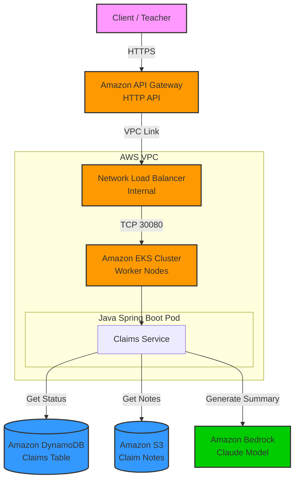

# Nexus Claims GenAI - Solution Architecture

## 1. Executive Summary

**The Challenge:** Insurance claim processing faces a critical bottleneck: the manual review of unstructured adjusters' notes. Adjusters spend valuable time reading through lengthy, fragmented text logs to understand the current status and history of a claim, delaying decision-making and customer response.

**The Solution:** The **Nexus Claims GenAI API** serves as a modern, scalable backend that automates the retrieval of claim status and leverages Generative AI (Amazon Bedrock) to instantly summarize complex claim history. This accelerates decision-making, reduces "time-to-insight" for adjusters, and improves customer satisfaction.

## 2. Solution Architecture

The following diagram illustrates the high-level architecture of the solution deployed on AWS.



## 3. Technology Choices & Rationale

### AI/ML: Amazon Bedrock (The Specialized Choice)
*   **Why:** A fully managed service for Generative AI that provides serverless access to high-performance foundation models.
*   **Customer Benefit:**
    *   **Instant Summarization:** We utilize the **Anthropic Claude** model to digest complex, unstructured text from claim notes (stored in S3) and produce a concise, human-readable summary.
    *   **Operational Efficiency:** Unlike self-hosting LLMs on EC2/GPU instances, Bedrock requires **zero infrastructure management**. We simply make an API call.
    *   **Cost & Scale:** We pay only for the tokens processed, avoiding the high cost of idle GPU instances.

### Compute: Amazon EKS (Elastic Kubernetes Service)
*   **Why:** Industry-standard container orchestration.
*   **Customer Benefit:** Provides a robust, scalable runtime for the Java application. It ensures high availability (pods are automatically restarted if they fail) and allows the business logic to scale independently of the database or AI components.

### Database: Amazon DynamoDB
*   **Why:** Serverless NoSQL database.
*   **Customer Benefit:** Delivers single-digit millisecond latency for claim status lookups. It scales automatically to handle sudden spikes in claim queries without manual intervention or maintenance windows.

### Storage: Amazon S3
*   **Why:** Object storage for unstructured data.
*   **Customer Benefit:** Stores the raw "adjuster notes" (text files) cost-effectively. S3 provides 99.999999999% durability, ensuring critical claim history is never lost.

### Networking: Amazon API Gateway & Network Load Balancer
*   **Why:** Secure and scalable entry point.
*   **Customer Benefit:**
    *   **API Gateway:** Acts as the "front door," managing traffic, security (throttling, potential auth), and providing a unified HTTP API endpoint.
    *   **Network Load Balancer (NLB):** Provides high-performance, private connectivity between the API Gateway and the EKS cluster within the VPC. This ensures traffic remains secure and low-latency.

### Infrastructure as Code: Terraform
*   **Why:** Infrastructure provisioning.
*   **Customer Benefit:** Enables "Environment as Code." The entire stack can be deployed, updated, or destroyed in minutes. This eliminates "configuration drift" and ensures the production environment matches development exactly.

## 4. Proof of Concept & Validation

### API Output (Log Proof)

The following logs demonstrate the successful end-to-end execution of the API, including the GenAI summarization.

**1. Retrieve Claim Status (DynamoDB Integration)**
```bash
$ curl https://r7twk4cv09.execute-api.us-east-1.amazonaws.com/claims/claim-101

{
  "claimId": "claim-101",
  "status": "IN_PROGRESS",
  "customerId": "cust-555",
  "incidentDate": "2024-03-15",
  "description": "Car accident on highway"
}
```

**2. Generate Claim Summary (Bedrock Integration)**
```bash
$ curl -X POST https://r7twk4cv09.execute-api.us-east-1.amazonaws.com/claims/claim-101/summarize

{
  "notes_summary": "Here's a summary of the claim notes:\n\nThe customer called to report a car accident. A police report was filed regarding the incident. The damaged vehicle was towed to an auto repair shop. An estimator at the shop evaluated the extent of the damages. Currently, the claim is awaiting the arrival of necessary parts to complete the repairs.",
  "claimId": "claim-101",
  "status": "IN_PROGRESS"
}
```

### Infrastructure Screenshots (Placeholders)

> **To the Teacher/Evaluator:** Please replace the following placeholders with actual screenshots from your deployment in the AWS Console.

#### 1. Amazon Bedrock (Metrics Proof)
*Access path:* `AWS Console -> Amazon CloudWatch -> Metrics -> All metrics -> Bedrock -> Across all models`
*Goal:* Show the **InvocationCount** graph with data points, proving the API successfully called the model.


#### 2. Amazon EKS (Cluster Status via CLI)
*Command:* Run `kubectl get pods -A` or `kubectl get nodes` in your terminal.
*Goal:* Show that the nodes are `Ready` and the `claims-service` pod is `Running`.


#### 3. Amazon API Gateway (Route Configuration)
*Access path:* `AWS Console -> API Gateway -> nexus-claims-genai-java-api -> Routes`
*Goal:* Show the `/claims` routes and the integration with the VPC Link.


#### 4. AWS CodeBuild (Build History)
*Access path:* `AWS Console -> CodeBuild -> Build projects -> nexus-claims-genai-java-build`
*Goal:* Show a "Succeeded" build status.


#### 5. Amazon ECR (Container Repository)
*Access path:* `AWS Console -> ECR -> Repositories -> nexus-claims-genai-java/claims-service`
*Goal:* Show the repository containing the `latest` image tag.


