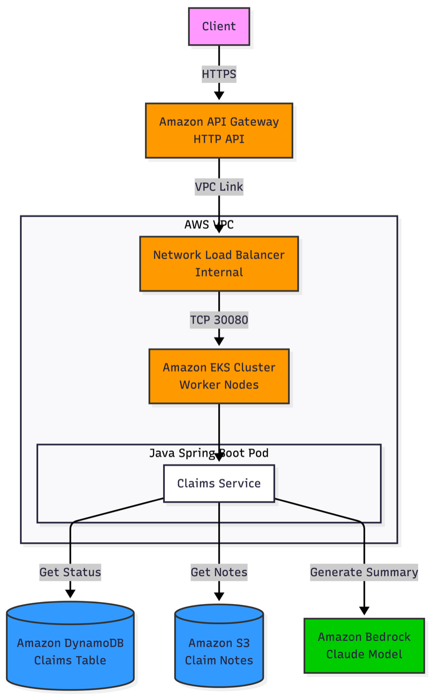
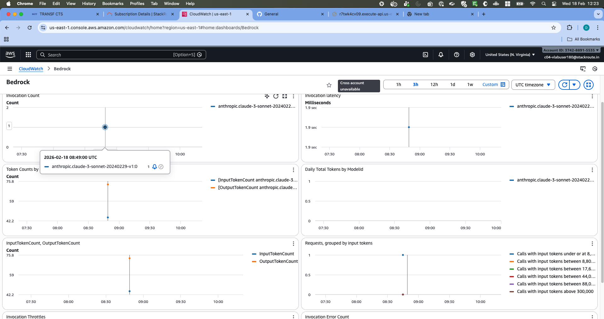
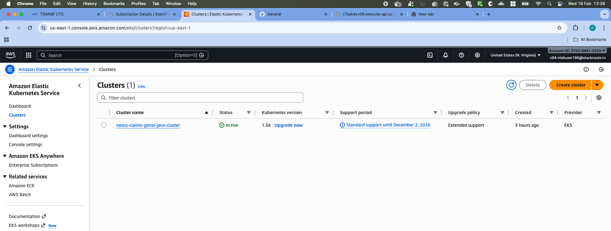
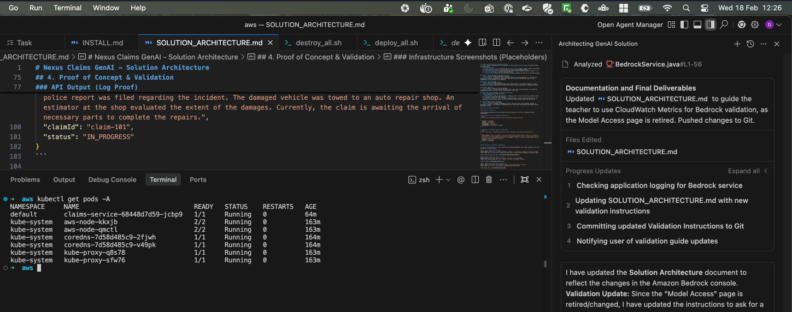
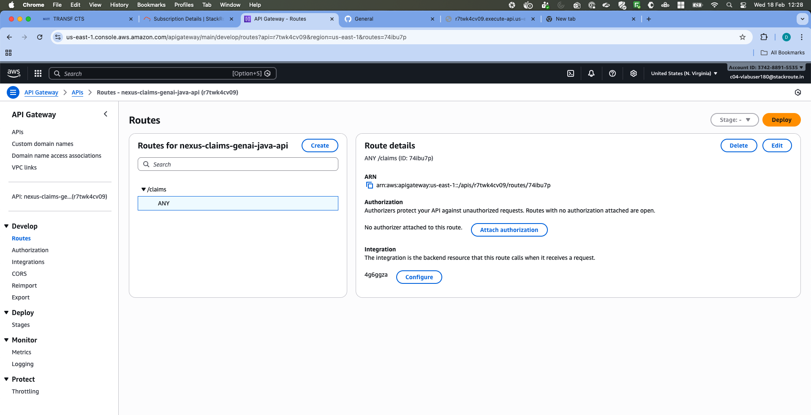
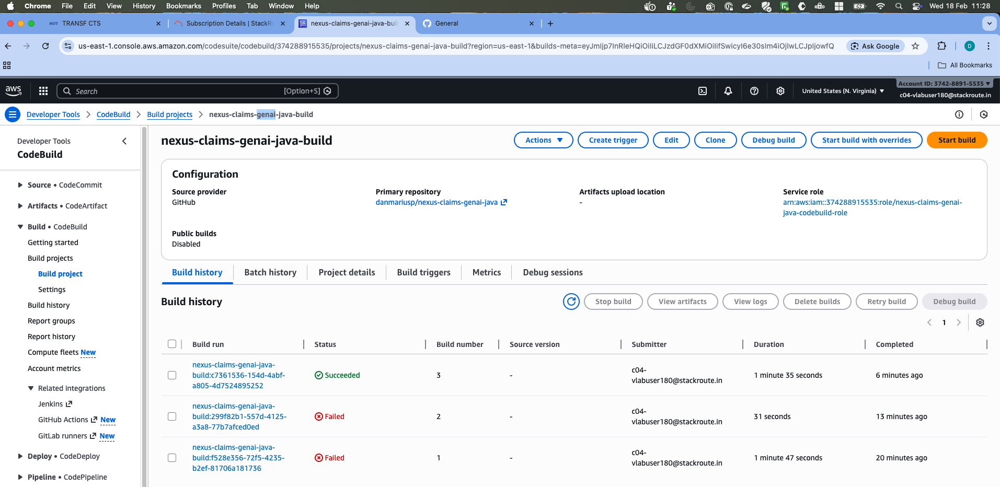
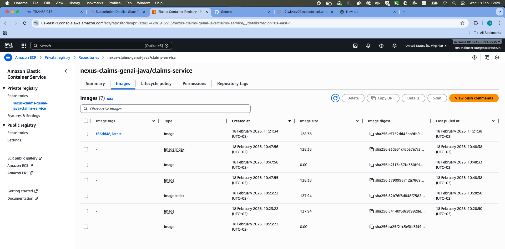
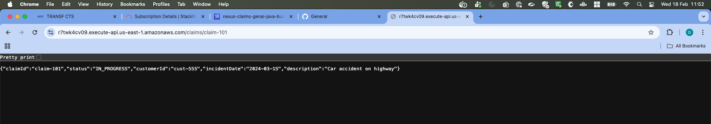

---
pdf_options:
  format: A4
  margin: 20mm
stylesheet: https://cdnjs.cloudflare.com/ajax/libs/github-markdown-css/5.2.0/github-markdown.min.css
body_class: markdown-body
css: |-
  img { max-width: 100%; height: auto; }
  table { font-size: 12px; }
---

# Nexus Claims GenAI - Solution Architecture

## 1. Executive Summary

**The Challenge:** Insurance claim processing faces a critical bottleneck: the manual review of unstructured adjusters' notes. Adjusters spend valuable time reading through lengthy, fragmented text logs to understand the current status and history of a claim, delaying decision-making and customer response.

**The Solution:** The **Nexus Claims GenAI API** serves as a modern, scalable backend that automates the retrieval of claim status and leverages Generative AI (Amazon Bedrock) to instantly summarize complex claim history. This accelerates decision-making, reduces "time-to-insight" for adjusters, and improves customer satisfaction.

## 2. Solution Architecture

The following diagram illustrates the high-level architecture of the solution deployed on AWS.



## 3. Technology Choices & Rationale

### AI/ML: Amazon Bedrock (The Specialized Choice)
*   **Why:** A fully managed service for Generative AI that provides serverless access to high-performance foundation models.
*   **Customer Benefit:**
    *   **Instant Summarization:** We utilize the **Anthropic Claude** model to digest complex, unstructured text from claim notes (stored in S3) and produce a concise, human-readable summary.
    *   **Operational Efficiency:** Unlike self-hosting LLMs on EC2/GPU instances, Bedrock requires **zero infrastructure management**. We simply make an API call.
    *   **Cost & Scale:** We pay only for the tokens processed, avoiding the high cost of idle GPU instances.

### Compute: Amazon EKS (Elastic Kubernetes Service)
*   **Why:** Industry-standard container orchestration.
*   **Customer Benefit:** Provides a robust, scalable runtime for the Java application. It ensures high availability (pods are automatically restarted if they fail) and allows the business logic to scale independently of the database or AI components.

### Database: Amazon DynamoDB
*   **Why:** Serverless NoSQL database.
*   **Customer Benefit:** Delivers single-digit millisecond latency for claim status lookups. It scales automatically to handle sudden spikes in claim queries without manual intervention or maintenance windows.

### Storage: Amazon S3
*   **Why:** Object storage for unstructured data.
*   **Customer Benefit:** Stores the raw "adjuster notes" (text files) cost-effectively. S3 provides 99.999999999% durability, ensuring critical claim history is never lost.

### Networking: Amazon API Gateway & Network Load Balancer
*   **Why:** Secure and scalable entry point.
*   **Customer Benefit:**
    *   **API Gateway:** Acts as the "front door," managing traffic, security (throttling, potential auth), and providing a unified HTTP API endpoint.
    *   **Network Load Balancer (NLB):** Provides high-performance, private connectivity between the API Gateway and the EKS cluster within the VPC. This ensures traffic remains secure and low-latency.

### Infrastructure as Code: Terraform
*   **Why:** Infrastructure provisioning.
*   **Customer Benefit:** Enables "Environment as Code." The entire stack can be deployed, updated, or destroyed in minutes. This eliminates "configuration drift" and ensures the production environment matches development exactly.

## 4. Proof of Concept & Validation

### API Output (Log Proof)

The following logs demonstrate the successful end-to-end execution of the API, including the GenAI summarization.

**1. Retrieve Claim Status (DynamoDB Integration)**
```bash
$ curl https://r7twk4cv09.execute-api.us-east-1.amazonaws.com/claims/claim-101

{
  "claimId": "claim-101",
  "status": "IN_PROGRESS",
  "customerId": "cust-555",
  "incidentDate": "2024-03-15",
  "description": "Car accident on highway"
}
```

**2. Generate Claim Summary (Bedrock Integration)**
```bash
$ curl -X POST https://r7twk4cv09.execute-api.us-east-1.amazonaws.com/claims/claim-101/summarize

{
  "notes_summary": "Here's a summary of the claim notes:\n\nThe customer called to report a car accident. A police report was filed regarding the incident. The damaged vehicle was towed to an auto repair shop. An estimator at the shop evaluated the extent of the damages. Currently, the claim is awaiting the arrival of necessary parts to complete the repairs.",
  "claimId": "claim-101",
  "status": "IN_PROGRESS"
}
```

### Infrastructure Screenshots

#### 1. Amazon Bedrock (Metrics Proof)
*Access path:* `AWS Console -> Amazon CloudWatch -> Metrics -> All metrics -> Bedrock -> Across all models`
*Goal:* Show the **InvocationCount** graph with data points, proving the API successfully called the model.



#### 2. Amazon EKS (Cluster Status via CLI)
*Command:* Run `kubectl get pods -A` or `kubectl get nodes` in your terminal.
*Goal:* Show that the nodes are `Ready` and the `claims-service` pod is `Running`.





#### 3. Amazon API Gateway (Route Configuration)
*Access path:* `AWS Console -> API Gateway -> nexus-claims-genai-java-api -> Routes`
*Goal:* Show the `/claims` routes and the integration with the VPC Link.



#### 4. AWS CodeBuild (Build History)
*Access path:* `AWS Console -> CodeBuild -> Build projects -> nexus-claims-genai-java-build`
*Goal:* Show a "Succeeded" build status.



#### 5. Amazon ECR (Container Repository)
*Access path:* `AWS Console -> ECR -> Repositories -> nexus-claims-genai-java/claims-service`
*Goal:* Show the repository containing the `latest` image tag.



#### 6. Browser access



## 5. API Usage
- `GET /claims/{id}` — Retrieve claim status from DynamoDB
- `POST /claims/{id}/summarize` — Generate AI summary of claim notes via Bedrock

## 6. Directory Structure
```
├── src/                       # Application source code (Java Spring Boot) + Helm charts
├── iac/                       # Terraform infrastructure code
│   ├── bootstrap/             # IAM roles for deployment
│   └── main/                  # Main infrastructure (EKS, VPC, DB, S3, API Gateway)
├── pipelines/                 # CI/CD definitions (CodeBuild buildspec)
├── scripts/                   # Deployment and data population scripts
├── mocks/                     # Sample data for Claims and Notes
├── images/                    # AWS Console screenshots (proof of deployment)
└── SOLUTION_ARCHITECTURE.md   # This document
```

## 7. Deployment Guide

### Prerequisites

Ensure you have the following tools installed and configured:

1.  **AWS CLI** (v2+): [Install Guide](https://docs.aws.amazon.com/cli/latest/userguide/getting-started-install.html)
    - Run `aws configure` to set your credentials and default region (`us-east-1`).
2.  **Terraform** (v1.0+): [Install Guide](https://developer.hashicorp.com/terraform/tutorials/aws-get-started/install-cli)
3.  **Docker**: [Install Guide](https://docs.docker.com/get-docker/) — ensure the daemon is running.
4.  **Helm**: [Install Guide](https://helm.sh/docs/intro/install/)
5.  **kubectl**: [Install Guide](https://kubernetes.io/docs/tasks/tools/)

### Quick Start (Automated Deployment)

1.  **Clone the Repository**:
    ```bash
    git clone https://github.com/danmariusp/nexus-claims-genai-java.git
    cd nexus-claims-genai-java
    ```

2.  **Run the Deployment Script**:
    ```bash
    ./scripts/deploy_all.sh
    ```
    This script will:
    - Validate AWS credentials.
    - Provision all infrastructure (IAM, VPC, EKS, DynamoDB, S3, API Gateway) via Terraform.
    - Build the Java application using Docker.
    - Push the Docker image to Amazon ECR.
    - Deploy the application to EKS using Helm.
    - Populate sample data into DynamoDB and S3.

3.  **Verify Deployment**:
    The script outputs the **API Endpoint** at the end. Test it immediately:
    ```bash
    curl <API_ENDPOINT>/claims/claim-101
    curl -X POST <API_ENDPOINT>/claims/claim-101/summarize
    ```

### Manual Deployment Steps

If you prefer to deploy step-by-step or need to debug:

#### Step 1. Bootstrap Infrastructure
```bash
cd iac/bootstrap
terraform init
terraform apply -auto-approve
ROLE_ARN=$(terraform output -raw builder_role_arn)
```

#### Step 2. Deploy Main Infrastructure
```bash
cd ../main
terraform init
terraform apply -auto-approve -var="builder_role_arn=$ROLE_ARN"
```

#### Step 3. Configure Kubernetes Access
```bash
aws eks update-kubeconfig --region us-east-1 --name nexus-claims-genai-java-cluster
```

#### Step 4. Build and Push Docker Image
```bash
ECR_URL=$(terraform output -raw ecr_repository_url)
aws ecr get-login-password --region us-east-1 | docker login --username AWS --password-stdin $ECR_URL

docker build -t $ECR_URL:latest ../../src/claims-service
docker push $ECR_URL:latest
```

#### Step 5. Deploy Application
```bash
helm upgrade --install claims-service ../../src/helm/claims-service \
    --set image.repository=$ECR_URL \
    --set image.tag="latest"
```

#### Step 6. Populate Data
```bash
cd ../..
./scripts/populate_data.sh
```

## 8. Troubleshooting

### Terraform Issues
| Error | Solution |
|---|---|
| `Error acquiring the state lock` | Run `terraform force-unlock <LOCK_ID>` if no other process is running. |
| `NoCredentialProviders` | Run `aws configure` to set valid access keys. |

### Application Issues
| Symptom | Solution |
|---|---|
| **503 Service Unavailable** | The app may still be starting. Wait 1-2 minutes. Check: `kubectl get pods` and `kubectl logs -l app.kubernetes.io/name=claims-service` |
| **GenAI Summary Fails** | Ensure Anthropic Claude is accessible in Bedrock (`us-east-1`). First-time users may need to submit use case details. Check pod IAM permissions (IRSA). |
| **Docker Push Access Denied** | Ensure the CodeBuild role has `AmazonEC2ContainerRegistryPowerUser` policy. |
| **EKS Unauthorized** | Ensure the deploying user/role ARN is in EKS Access Entries (managed in `cicd.tf`). |

## 9. Cleanup

To destroy all resources and avoid costs:

```bash
./scripts/destroy_all.sh
```